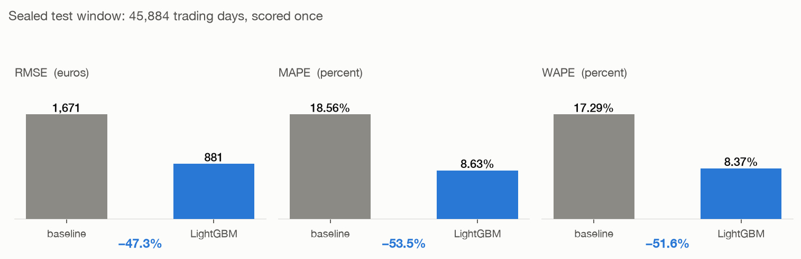
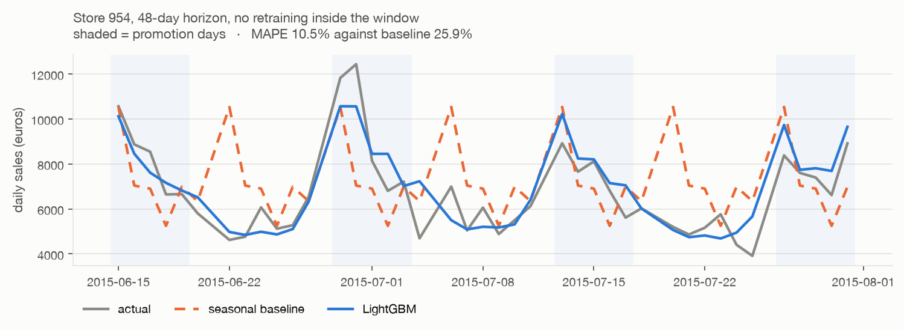
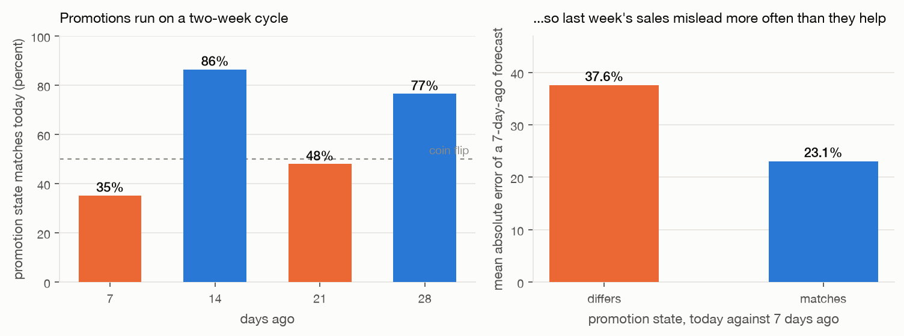
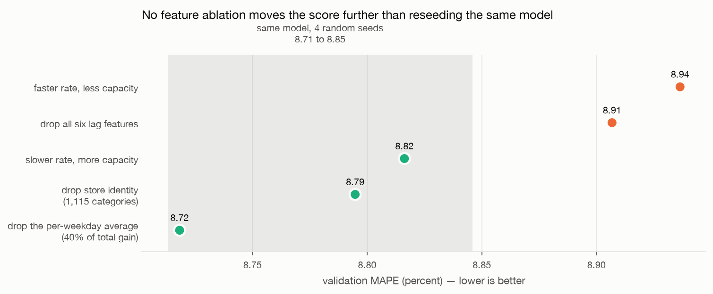
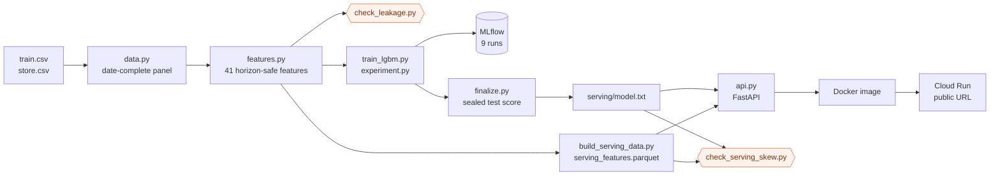

# Rossmann demand forecasting

Daily sales forecasts for 1,115 drugstores. The horizon is 42 days. A
containerised API serves the forecasts from Cloud Run.

Live: https://rossmann-forecast-1024147309293.europe-west1.run.app
([docs](https://rossmann-forecast-1024147309293.europe-west1.run.app/docs) ·
[sample forecast](https://rossmann-forecast-1024147309293.europe-west1.run.app/predict?store_id=262&start_date=2015-07-06&end_date=2015-07-12))

Result on the test window: 8.63% MAPE. The seasonal baseline scores 18.56%.
The error is 53.5% lower. No step before the final one used this window.

| Model | RMSE (EUR) | MAPE | WAPE |
|---|---|---|---|
| Seasonal median baseline | 1,671 | 18.56% | 17.29% |
| LightGBM | 881 | 8.63% | 8.37% |
| Improvement | 47.3% | 53.5% | 51.6% |

The test window is 2015-06-14 to 2015-07-31. It contains 45,884 trading days
across all 1,115 stores. Closed days get a forecast of zero. The metrics
exclude them.



---

## The problem

A store manager orders stock and plans staff shifts. To do this the manager
needs to know what each of the next 42 days will sell. Too little stock loses
sales. Too much stock costs cash and creates waste.

Two properties make the task harder than a standard regression.

The horizon is long. To predict tomorrow you can use yesterday. At 42 days the
most recent sales are six weeks old. The obvious features do not exist at
forecast time. This constraint controls the feature design below.

The stores are different from each other. Mean daily sales run from about
3,250 to 15,475 EUR. A model that fits the average store is wrong for most
individual stores.

The data is the public Rossmann Store Sales dataset. It has 1,017,209 rows
from 2013-01-01 to 2015-07-31. A second file describes each store: store type,
assortment level, competitor distance, and promotion programme membership.

## Results

Both windows, model against baseline:

| Window | | RMSE | MAPE | WAPE |
|---|---|---|---|---|
| Validation (2015-04-27 to 06-13) | baseline | 1,731 | 17.16% | 16.65% |
| | LightGBM | 929 | 8.91% | 8.75% |
| Test (2015-06-14 to 07-31) | baseline | 1,671 | 18.56% | 17.29% |
| | LightGBM | 881 | 8.63% | 8.37% |

The test score is better than the validation score. This is unusual, and it
has a specific cause. The two windows are not equally difficult.

```
                     valid    test
school holiday rate  0.075   0.290
state holiday rate   0.077   0.000
```

The validation window covers late April to mid June. It contains the German
spring public holidays: Labour Day, Ascension, Whit Monday and Corpus Christi.
These force closures and move sales to other days. The test window contains no
state holidays.

The test window has four times the school holiday rate instead. German summer
holidays start in July. The baseline therefore got worse on the test window,
from 17.16% to 18.56%. A weekday median cannot see school holidays. The model
has the flag as a feature, so it got better.



The chart shows one store across the whole horizon, with no retraining inside
the window. The baseline repeats the same weekday shape each week. For half
the weeks it is therefore in the wrong phase of the promotion cycle. The model
follows the actual series because it reads the promotion calendar.

## Method

### Baseline

The benchmark is a seasonal median. For each store, take the median of each
weekday over the previous four weeks. It fits no parameters. It already
captures the two largest patterns: the store level and the weekly shape. It is
therefore difficult to beat, and the comparison is fair. A baseline that
predicts the overall mean would be too weak to mean anything.

SARIMA(2,0,1)(1,1,1,7) ran on a stratified sample of 15 stores as a classical
reference. It scored 15.37% MAPE. The seasonal median scored 16.55% on the
same stores. On 584 observations this is a tie, and two of the three metrics
favour the seasonal median.

The reason is structural, not an implementation problem. SARIMA reads the
sales history of one store and nothing else. It cannot read the promotion
flag, which moves revenue by 38.8%. Its seasonal period is 7 days, so it
cannot represent a 14 day promotion cycle at all.

### Horizon-safe features

Each feature that comes from sales has a lag of 48 days or more.

```
horizon day 48 -> lag_49 reads cutoff - 2    (known)
horizon day  1 -> lag_49 reads cutoff - 49   (known)
```

Every value is on the known side of the cutoff, for every day in the horizon.

Three designs were possible. Recursive forecasting predicts day 1, then feeds
that prediction back to predict day 8. Per-horizon models train one model for
each week of the horizon. The horizon-safe design gives up recent data
instead. The result:

- one model predicts all 42 days in one pass
- the model never reads its own output, so errors do not accumulate
- the API keeps no state: one lookup and one forward pass for each request

The cost is the loss of recent data. The ablations below show that the lag
features add little, so this cost is small.

The model uses 41 features in six groups: calendar, promotion context, decoded
Promo2, competition, sales history, and store attributes.

Two encoding decisions:

The weekday has no sine and cosine encoding. That encoding lets a linear model
or a neural network see that Monday follows Sunday. A boosted tree splits on
thresholds and can isolate one day with two splits. Sine and cosine make the
tree approximate a step with a curve. This costs splits and adds nothing.

Promo2 is decoded, not passed through. The raw flag correlates negatively with
sales, because the smaller stores joined the programme. What predicts sales is
whether the programme is active on that date, and whether the month is one of
its restart months. This needs three columns, one of which holds a
comma-separated month list.

### Model

LightGBM on `log1p(sales)`, trading days only. Early stopping on the
validation window chose 407 boosting rounds.

The log target makes the loss function agree with the metric. Squared error on
the log target is close to percentage error on the real target, and percentage
error is what MAPE measures. Without the log, the loss counts euros while the
metric counts percentages.

## Findings

### Promotions run on a two week cycle

The same weekday one week ago falls in the opposite promotion state 65% of the
time:

```
P(promo today == promo  7d ago) = 0.352
P(promo today == promo 14d ago) = 0.864
P(promo today == promo 28d ago) = 0.765
```

Promotions move revenue by 38.8%. A 7 day lag is therefore wrong in a
predictable direction:

```
promo state DIFFERS   29,500 rows   37.56% mean error
promo state MATCHES   13,565 rows   23.05% mean error
```



A lag-7 baseline scored 32.99%. The four week weekday median scored 17.16%.
The lag-7 rule was allowed to read data from inside the forecast window and
still lost by a wide margin. A median over four weeks covers about two
promotion weeks and two normal weeks, so it lands near the middle.

The general rule: a lag feature is only as good as the match between its
window and the business cycle underneath it.

### Feature importance and feature contribution disagreed

By gain, the largest feature was `dow_mean_4` at 40% of the total. Remove it,
train again, and the model gets slightly better.

Six ablations ran in MLflow. Four more runs used one configuration and
different random seeds. Those four measure how much the score moves for no
reason:

```
identical config, four seeds: 8.762, 8.757, 8.713, 8.846
mean 8.770   std 0.056   range 0.133
```

Against that noise level:

| Variant | MAPE | vs full | Outside the noise? |
|---|---|---|---|
| `no_dow_mean` | 8.72 | -0.04 | no |
| `no_store` | 8.79 | +0.03 | no |
| `lr_0.03_leaves_256` | 8.82 | +0.05 | no |
| `no_lags` | 8.91 | +0.14 | at the edge |
| `lr_0.10_leaves_64` | 8.94 | +0.17 | at the edge |



No feature ablation moved the score further than a change of random seed.

The feature set is redundant. Remove the per-weekday average and the model
rebuilds it from the rolling means, the store identity and the weekday. Remove
the store identity and it recovers the store level from the rolling means.
Each subset reaches about the same answer by a different route. This is why
`no_store` needed 865 iterations to reach what `full` reached in 609.

Gain shows which feature the model split on first. Early splits always remove
the most loss, so the first feature collects a large share. Gain is not a
measure of how much a feature adds to the accuracy. To measure that, remove
the feature and train again.

The 49% improvement over the baseline is not in this category. It is about 150
standard deviations wide.

The deployed model is `no_lags`. Among the variants that tie, it is the
smallest: 41 features instead of 47, and 407 rounds instead of 609.

## Correctness tests

Two faults cause most failures in deployed forecasting systems. Both have a
test here. The second test found a real fault.

### Time leakage (`src/check_leakage.py`)

The test builds every sales feature a second time on a copy of the data. In
the copy, all sales from the validation window onward are removed. The copy
therefore holds only what is known at the cutoff. The test then compares the
validation rows in both versions.

```
validation rows compared: 53,520
sales-derived features:   19
PASS: every sales-derived feature is identical with and
      without access to validation-window sales.
```

An error of one day in a rolling window is not visible on the page. It also
raises the score by a large amount.

### Training and serving differences (`src/check_serving_skew.py`)

The first version of the API returned 8,067 EUR for a day whose actual value
was 19,894. The model was correct. Offline, the same model on the same row
returned 18,822.

The serving pipeline rebuilt its categorical encodings and cast them to string
first. Strings sort alphabetically. Integers sort numerically:

```
training: [1, 2, 3, 4, 5]
serving:  ['1', '10', '100', '1000', '1001']
```

LightGBM stores a categorical feature as an integer code and maps it by
position. Each store therefore became a different store. No code raised an
error. The response matched its schema. The status was 200. The numbers looked
reasonable.

The repair has two parts. `src/encoding.py` holds one implementation of the
encoding, and the training path, the serving-data build and the API all call
it. The test then runs both paths over every shared row and compares the
output.

```
rows compared: 53,520
max absolute difference: 0.0000000000
PASS: serving path and offline path agree exactly.
```

Both tests work the same way. Neither knows the correct answer. Each compares
two paths that must agree. When a fault produces a reasonable number instead
of a crash, a check on the output cannot find it. Only a comparison can.

## Service

```
GET  /health              model provenance, metrics, servable range
GET  /stores              store IDs the service can forecast
POST /predict             {store_id, start_date, end_date}
GET  /predict?...         the same, as a query string
GET  /docs                OpenAPI interface
```

The Kaggle test period has no published sales. No step in this project has
seen those dates:

```bash
curl "$URL/predict?store_id=262&start_date=2015-08-03&end_date=2015-08-09"
```

For dates inside the public dataset the response also returns the actual sales
and the error for each day:

```
2015-07-06  Mon  pred 18,822  actual 19,894   5.4%
2015-07-07  Tue  pred 17,250  actual 17,208   0.2%
2015-07-10  Fri  pred 20,008  actual 20,519   2.5%
2015-07-12  Sun  pred 27,434  actual 32,271  15.0%
window MAPE 5.93%
```

The service returns 400 for any date after 2015-09-17. That date is 48 days
after the last day of sales history. Past it the features would need data that
does not exist.

The container image is 889 MB. It uses 250 MB of memory and starts in about
2 seconds. It runs one uvicorn worker. The model and the feature table load
into memory at import, so a second worker would duplicate them. Cloud Run adds
container instances instead.

Measured on the deployed service: about 120 ms for each request. A full 48 day
forecast for one store takes 133 ms. Process overhead and the parquet lookup
control this time, not the model. 48 days is one batched forward pass, not 48
calls in sequence.

Cloud Build builds the image, not the local machine. Apple Silicon is arm64
and Cloud Run is amd64. An image built on a Mac and pushed without change
deploys correctly and then fails on every request with `exec format error`.

## Pipeline



The two orange nodes are the correctness tests.

## Repository

```
src/
  data.py                 loading, date-complete panel, splits by date
  metrics.py              RMSE, MAPE, WAPE, trading days only
  explore.py              data checks
  baseline.py             seasonal baselines
  sarima.py               classical reference on a store sample
  features.py             41 horizon-safe features
  encoding.py             the one categorical encoding implementation
  check_leakage.py        time leakage test
  check_serving_skew.py   training and serving comparison
  train_lgbm.py           model training
  experiment.py           MLflow ablations and seed runs
  finalize.py             sealed test score, files for serving
  build_serving_data.py   prepared serving feature table
  api.py                  FastAPI service
  landing.html            landing page served at /
  make_figures.py         the figures in this README
  submit_kaggle.py        Kaggle submission, with a measured multiplier
scripts/
  smoke_test.sh           behaviour checks against a running service
  deploy_cloudrun.sh      build on Cloud Build, deploy to Cloud Run
Dockerfile
requirements-serve.txt    serving dependencies only, no training stack
```

## How to run it

Download the data from Kaggle (`rossmann-store-sales`) into the repository
root. Then:

```bash
python3 -m venv .venv && .venv/bin/pip install -r requirements.txt

PYTHONPATH=src .venv/bin/python src/explore.py            # data checks
PYTHONPATH=src .venv/bin/python src/baseline.py           # baselines
PYTHONPATH=src .venv/bin/python src/features.py           # build features
PYTHONPATH=src .venv/bin/python src/check_leakage.py      # leakage test
PYTHONPATH=src .venv/bin/python src/train_lgbm.py         # train
PYTHONPATH=src .venv/bin/python src/experiment.py         # MLflow runs
PYTHONPATH=src .venv/bin/python src/finalize.py           # sealed test score
PYTHONPATH=src .venv/bin/python src/build_serving_data.py
PYTHONPATH=src .venv/bin/python src/check_serving_skew.py # skew test
PYTHONPATH=src .venv/bin/python src/make_figures.py
PYTHONPATH=src .venv/bin/python src/submit_kaggle.py

mlflow ui --backend-store-uri sqlite:///mlflow.db

docker build -t rossmann-forecast:local .
docker run -p 8080:8080 rossmann-forecast:local
./scripts/smoke_test.sh http://localhost:8080

./scripts/deploy_cloudrun.sh <PROJECT_ID> europe-west1
```

## Limits

December is not in the holdout. December sales run about 25% above the
baseline level, and it is the largest seasonal event in the data. Neither the
validation window nor the test window contains it. The reported error is
therefore lower than a full-year figure would be.

There is no path for a new store. Each rolling feature needs history, so the
model cannot forecast a store that has just opened. Such a store would need a
separate model that uses the store attributes only. This is not built.

Sunday comes from 33 stores. Only 33 of the 1,115 stores ever trade on a
Sunday, and they sell more than on any weekday. The largest daily error in the
example above is the Sunday, which is 15% low. This is the expected result.

The 48 day limit is fixed. The service cannot forecast past 2015-09-17,
because the features would need sales that do not exist. This is the cost of
not using recursive prediction.

One model covers the whole horizon. The accuracy at day 1 and at day 42 is not
separated. Models for each part of the horizon would probably be better at
short range. They would need seven models to train, record and serve.

The serving table is static. The features are calculated in advance and stored
in the image. A production system would rebuild them on a schedule as new
sales arrive, and would monitor the features for drift.

## Next steps

Add prediction intervals. An ordering decision needs a range, not one number.
The LightGBM quantile objective at the 10th and 90th percentiles is a direct
extension.

Trigger retraining from a monitored error level, not from a fixed schedule.

Test whether the redundancy result holds at a longer horizon. The lag features
may separate from the rolling means there.
