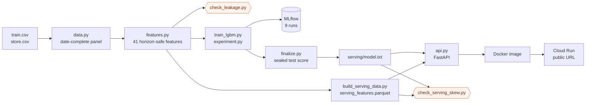

# Rossmann demand forecasting

Daily sales forecasts for 1,115 drugstores over a 42 day horizon, served from a
containerised API on Cloud Run.

**Live:** https://rossmann-forecast-1024147309293.europe-west1.run.app
([docs](https://rossmann-forecast-1024147309293.europe-west1.run.app/docs) ·
[sample forecast](https://rossmann-forecast-1024147309293.europe-west1.run.app/predict?store_id=262&start_date=2015-07-06&end_date=2015-07-12))

**Test-set result: 8.63% MAPE against an 18.56% seasonal baseline, a 53.5%
reduction in error.** Scored once, on a window sealed from the first stage of
the project.

| Model | RMSE (EUR) | MAPE | WAPE |
|---|---|---|---|
| Seasonal median baseline | 1,671 | 18.56% | 17.29% |
| LightGBM | 881 | **8.63%** | 8.37% |
| Improvement | 47.3% | 53.5% | 51.6% |

Test window 2015-06-14 to 2015-07-31, 45,884 trading days across all 1,115
stores. Closed days are predicted as zero and excluded from scoring.


---

## The problem

A store manager ordering stock and rostering staff needs to know what each of
the next 42 days will sell. Ordering short loses sales, ordering long ties up
cash and creates waste.

Two properties make this harder than a typical regression:

The horizon is long. Predicting tomorrow is easy because yesterday tells you
most of it. At 42 days out, "recent sales" is six weeks stale and the obvious
features are unavailable by construction. This constraint drives the entire
feature design below.

The stores are not interchangeable. Average daily sales run from about 3,250 to
15,475 EUR across the chain, so a model that fits the average store is wrong for
most individual stores.

Data: the public Rossmann Store Sales dataset. 1,017,209 rows covering
2013-01-01 to 2015-07-31, plus per-store metadata (store type, assortment
breadth, competitor distance, promotion programme membership).

## Result detail

Both windows, model against baseline:

| Window | | RMSE | MAPE | WAPE |
|---|---|---|---|---|
| Validation (2015-04-27 to 06-13) | baseline | 1,731 | 17.16% | 16.65% |
| | LightGBM | 929 | 8.91% | 8.75% |
| Test (2015-06-14 to 07-31) | baseline | 1,671 | 18.56% | 17.29% |
| | LightGBM | 881 | 8.63% | 8.37% |

The test score is slightly better than validation, which is unusual and has a
specific cause rather than being luck. The validation window contains Germany's
dense spring public holiday run (Labour Day, Ascension, Whit Monday, Corpus
Christi); the test window contains none. The test window instead carries four
times the school holiday rate, because German summer holidays begin in July.
That is why the baseline got *worse* on test while the model got better: a
weekday median has no concept of school holidays, and the model has the flag as
a feature.

```
                     valid    test
school holiday rate  0.075   0.290
state holiday rate   0.077   0.000
```


One store across the whole horizon, with no retraining inside the window. The
baseline repeats the same weekday shape every week, so it runs in the opposite
phase to the promotion cycle for half the time. The model tracks the actual
series because it can see the promotion calendar.

## Approach

### Baseline

The benchmark is seasonal naive: per store, the median of each weekday over the
preceding four weeks. Zero fitted parameters, and it already captures the two
dominant patterns (store level and weekly rhythm), which makes it hard to beat
and therefore a fair comparison. A "predict the overall mean" baseline would
have been a strawman.

SARIMA(2,0,1)(1,1,1,7) was fitted on a stratified sample of 15 stores as a
classical reference. It scored 15.37% MAPE against the naive rule's 16.55% on
the same stores: a tie on 584 observations, with two of three metrics favouring
the naive rule. The reason is structural, not implementation quality. SARIMA
sees one store's own sales history and nothing else, so the largest driver in
the dataset (promotions, a 38.8% swing) is invisible to it, and its seasonal
period of 7 cannot represent the 14 day promotion cycle at all.

### Horizon-safe features

Every sales-derived feature is lagged by at least 48 days. For horizon day 48 a
lag-49 feature reaches back to the cutoff minus 2; for horizon day 1 it reaches
the cutoff minus 49. Every value is on the known side of the line for every day
in the horizon.

This was a deliberate choice over recursive forecasting (predict day 1, feed it
back to predict day 8) and over per-horizon models. The consequences:

- one model predicts all 42 days in a single pass
- no error compounding from feeding predictions back as inputs
- the API is stateless: a lookup and one forward pass per request

The cost is giving up genuinely recent signal. Given that the ablations below
show the lag features contribute little either way, that cost was small.

41 features in six blocks: calendar, promotion context, decoded Promo2,
competition, sales history (rolling means, standard deviations, trend, same
weekday history), and store static attributes.

Two encoding decisions worth noting:

**No cyclical encoding of weekday.** Sine/cosine encoding exists so linear
models and neural networks can see that Monday adjoins Sunday. A gradient
boosted tree splits on thresholds and isolates any single day in two splits.
Encoding it smoothly forces the tree to approximate a step function, costing
splits for no gain.

**Promo2 decoded rather than passed through.** The raw flag correlates
*negatively* with sales, purely because smaller stores joined the programme.
What is predictive is whether it is active on that date and whether the month is
one of its restart months, which requires parsing three columns including a
comma-separated month list.

### Model

LightGBM on `log1p(sales)`, trading days only, 407 boosting rounds chosen by
early stopping on the validation window.

Training on the log target is the choice that makes the loss agree with the
metric. Squared error on the log target is approximately percentage error on the
real target, which is what MAPE measures. Without it the loss optimises euros
while the metric grades percentages.

## Findings

### Promotions run on a two week cycle, which breaks the obvious lag

Same weekday one week ago lands on the *opposite* promotion state 65% of the
time:

```
P(promo today == promo  7d ago) = 0.352
P(promo today == promo 14d ago) = 0.864
P(promo today == promo 28d ago) = 0.765
```

Since promotions move revenue by 38.8%, a lag-7 feature is systematically wrong
in a predictable direction:

```
promo state DIFFERS   29,500 rows   37.56% average error
promo state MATCHES   13,565 rows   23.05% average error
```


This is why a lag-7 baseline scored 32.99% while the four week weekday median
scored 17.16%, despite the former being allowed to peek at data inside the
forecast window. Averaging over four weeks spans roughly two promotion weeks and
two non-promotion weeks and lands near the middle. Generalisation: a lag feature
is only as good as the alignment between its window and the underlying business
cycle.

### Feature importance and feature contribution gave opposite answers

By gain, the top feature was `dow_mean_4` at 40% of the total. Removing it and
retraining made the model marginally *better*.

Six ablations were run and tracked in MLflow, alongside four runs of an
identical configuration under different random seeds to establish how much a
score moves for no reason at all:

```
identical config, four seeds: 8.762, 8.757, 8.713, 8.846
mean 8.770   std 0.056   range 0.133
```

Against that noise floor:

| Variant | MAPE | vs full | Beyond noise? |
|---|---|---|---|
| `no_dow_mean` | 8.72 | -0.04 | no |
| `no_store` | 8.79 | +0.03 | no |
| `lr_0.03_leaves_256` | 8.82 | +0.05 | no |
| `no_lags` | 8.91 | +0.14 | marginal |
| `lr_0.10_leaves_64` | 8.94 | +0.17 | marginal |


Not one feature ablation produced an effect larger than reseeding the same
model. The feature set is highly redundant: delete the per-weekday average and
the model rebuilds it from rolling means, store identity and weekday; delete
store identity and it recovers the level from the rolling means. Every subset
reaches roughly the same answer by a different route, which is why `no_store`
needed 865 iterations to reach what `full` reached in 609.

Gain measures which feature the model reached for first, because early splits
always remove the most loss. It is not an allocation of predictive credit. The
only way to measure contribution is removal.

The 49% improvement over baseline is not in that category: it is about 150
standard deviations wide.

The deployed model is `no_lags`, the cheapest configuration among the
statistically tied ones: 41 features instead of 47, 407 rounds instead of 609.

## Correctness tests

Two failure modes account for most of what goes wrong in deployed forecasting
systems. Both have automated tests here, and the second one caught a real bug.

### Temporal leakage (`src/check_leakage.py`)

Rebuilds every sales-derived feature on a copy of the data with all sales from
the validation window onward erased, reproducing what is knowable standing at
the cutoff, then asserts the validation rows are bit-identical to the version
built with full data.

```
validation rows compared: 53,520
sales-derived features:   19
PASS: every sales-derived feature is identical with and
      without access to validation-window sales.
```

A single off-by-one in a rolling window is invisible to inspection and inflates
scores substantially.

### Train/serve skew (`src/check_serving_skew.py`)

The first version of the API returned 8,067 EUR for a day whose actual was
19,894. The model was fine: offline, the same model on the same row predicted
18,822.

The serving pipeline rebuilt its categorical encodings from scratch, casting to
string first. Strings sort lexicographically, integers numerically:

```
training: [1, 2, 3, 4, 5]
serving:  ['1', '10', '100', '1000', '1001']
```

LightGBM stores categoricals as integer codes and maps them by position, so
every store was scored as a different store. No exception, valid schema, HTTP
200, plausible-looking numbers.

Two structural fixes: `src/encoding.py` holds one implementation that the
training, serving-data and API paths all call, and the test runs both paths over
every shared row and asserts agreement.

```
rows compared: 53,520
max absolute difference: 0.0000000000
PASS: serving path and offline path agree exactly.
```

Both tests are differential: neither knows the correct answer, both compare two
paths that must agree. When a bug's symptom is a plausible number rather than a
crash, assertions on the output cannot catch it and only a comparison can.

## Service

```
GET  /health              model provenance, metrics, servable range
GET  /stores              store IDs the service can forecast
POST /predict             {store_id, start_date, end_date}
GET  /predict?...         same, query string
GET  /docs                OpenAPI UI
```

Example, on dates from Kaggle's held-out period that nothing in this project has
ever seen:

```bash
curl "$URL/predict?store_id=262&start_date=2015-08-03&end_date=2015-08-09"
```

For dates inside the public dataset the response also carries actuals and the
per-day error, so accuracy is visible live rather than asserted:

```
2015-07-06  Mon  pred 18,822  actual 19,894   5.4%
2015-07-07  Tue  pred 17,250  actual 17,208   0.2%
2015-07-10  Fri  pred 20,008  actual 20,519   2.5%
2015-07-12  Sun  pred 27,434  actual 32,271  15.0%
window MAPE 5.93%
```

The service refuses dates past 2015-09-17 with a 400 rather than degrading
quietly. That bound is exactly 48 days past the last day of sales history, which
is the boundary the horizon-safe feature design implies.

Container: 889 MB image, 250 MB resident, roughly 2 second cold start. One
uvicorn worker on purpose, since the booster and feature table load at import
and Cloud Run scales by adding instances rather than workers.

Measured on the deployed service: about 120 ms per request, and a full 48 day
forecast for one store takes 133 ms, barely more than a single day. The cost is
dominated by the parquet lookup and process overhead rather than by inference,
which is what the horizon-safe design buys: 48 days is one batched forward pass,
not 48 sequential ones.

Deployment builds on Cloud Build rather than locally. Apple Silicon is arm64 and
Cloud Run is amd64; an image built natively on a Mac and pushed as-is deploys
successfully and then dies on every request with `exec format error`.

## Pipeline



The two orange nodes are the correctness tests. `check_leakage.py` compares the
feature build against a version that cannot see the future.
`check_serving_skew.py` compares the offline path against the serving path.
Neither knows the right answer. Both compare two paths that must agree.

## Repository

```
src/
  data.py                 loading, date-complete panel, time-based splits
  metrics.py              RMSE, MAPE, WAPE, open-days-only convention
  explore.py              stage 1 exploration
  baseline.py             seasonal naive baselines
  sarima.py               classical reference on a store sample
  features.py             41 horizon-safe features
  encoding.py             the single categorical encoding implementation
  check_leakage.py        temporal leakage test
  check_serving_skew.py   train/serve skew test
  train_lgbm.py           model training
  experiment.py           MLflow-tracked ablations and seed runs
  finalize.py             sealed test evaluation, serving artifact export
  build_serving_data.py   precomputed serving feature table
  api.py                  FastAPI service
  landing.html            landing page served at /
  make_figures.py         the figures in this README
  submit_kaggle.py        Kaggle submission with a measured calibration factor
scripts/
  smoke_test.sh           behavioural checks against a running service
  deploy_cloudrun.sh      build on Cloud Build, deploy to Cloud Run
Dockerfile
requirements-serve.txt    serving dependencies only, no training stack
```

## Running it

```bash
python3 -m venv .venv && .venv/bin/pip install -r requirements.txt

PYTHONPATH=src .venv/bin/python src/explore.py           # stage 1
PYTHONPATH=src .venv/bin/python src/baseline.py          # stage 2
PYTHONPATH=src .venv/bin/python src/features.py          # stage 3
PYTHONPATH=src .venv/bin/python src/check_leakage.py     # leakage test
PYTHONPATH=src .venv/bin/python src/train_lgbm.py        # stage 4
PYTHONPATH=src .venv/bin/python src/experiment.py        # stage 5, MLflow
PYTHONPATH=src .venv/bin/python src/finalize.py          # sealed test eval
PYTHONPATH=src .venv/bin/python src/build_serving_data.py
PYTHONPATH=src .venv/bin/python src/check_serving_skew.py
PYTHONPATH=src .venv/bin/python src/make_figures.py
PYTHONPATH=src .venv/bin/python src/submit_kaggle.py

mlflow ui --backend-store-uri sqlite:///mlflow.db

docker build -t rossmann-forecast:local .
docker run -p 8080:8080 rossmann-forecast:local
./scripts/smoke_test.sh http://localhost:8080

./scripts/deploy_cloudrun.sh <PROJECT_ID> europe-west1
```

## Limitations

Stated rather than buried, because each one is a question worth being asked.

**No December in the holdout.** December averages roughly 25% above baseline and
is the largest seasonal event in the data. Neither the validation nor the test
window contains it, so the reported error is optimistic relative to year-round
performance.

**No cold start path.** Every rolling feature needs history, so a newly opened
store cannot be forecast at all. It would fall back to store metadata only,
which is not implemented.

**Sunday is learned from 33 stores.** Only 33 of 1,115 ever trade on Sundays,
and they average higher than any weekday. The worst per-day error in the example
above is the Sunday, undershooting by 15%, which is the expected consequence.

**The 48 day bound is hard.** The service cannot forecast past 2015-09-17
because the features would require sales that do not exist. This is the honest
cost of avoiding recursive prediction.

**One model, one horizon.** Accuracy at day 1 and day 42 is not separated. Per
horizon models would likely beat this at short range, at the cost of seven
models to train, track and serve.

**Static serving table.** Features are precomputed and frozen into the image. A
production system would recompute on a schedule as new sales land, and would
need monitoring for feature drift.

## Next steps

Prediction intervals rather than point forecasts, since an ordering decision
needs a plausible range. LightGBM's quantile objective at the 10th and 90th
percentiles would be a direct extension.

A retraining trigger driven by monitored error rather than a fixed schedule.

Testing whether the redundancy finding holds under a longer horizon, where the
lag features may separate more clearly from the rolling aggregates.
